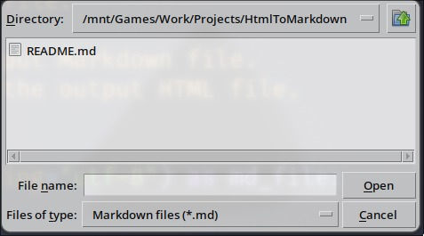
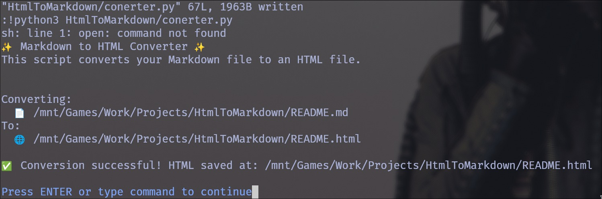
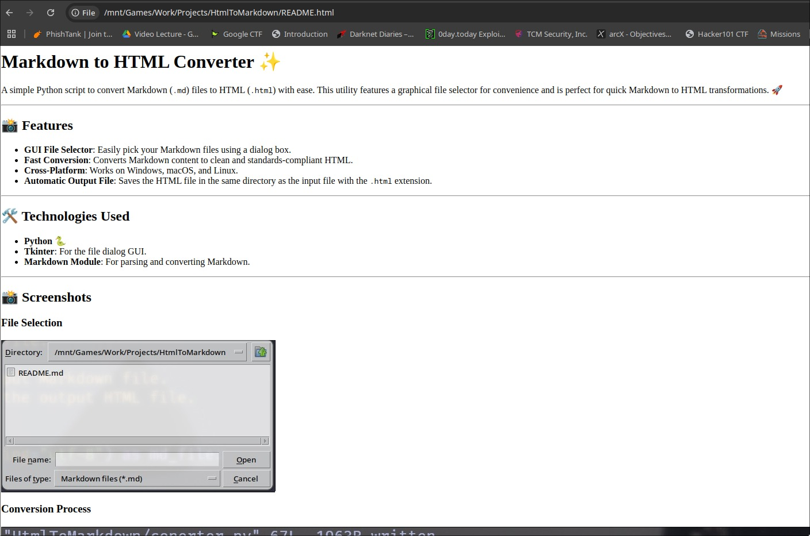

# Markdown to HTML Converter ✨

A simple Python script to convert Markdown (`.md`) files to HTML (`.html`) with ease. This utility features a graphical file selector for convenience and is perfect for quick Markdown to HTML transformations. 🚀

---

## 📸 Features

- **GUI File Selector**: Easily pick your Markdown files using a dialog box.
- **Fast Conversion**: Converts Markdown content to clean and standards-compliant HTML.
- **Cross-Platform**: Works on Windows, macOS, and Linux.
- **Automatic Output File**: Saves the HTML file in the same directory as the input file with the `.html` extension.

---

## 🛠️ Technologies Used

- **Python** 🐍
- **Tkinter**: For the file dialog GUI.
- **Markdown Module**: For parsing and converting Markdown.

---

## 📸 Screenshots

### File Selection



### Conversion Process

## 

## 

## 🚀 Usage

<!-- TODO: Change git url -->

1. **Clone or Download the Repository**:

   ```bash
   git clone https://github.com/tobechanged/markdown-to-html.git
   cd markdown-to-html
   ```

2. **Install Required Modules**:
   Ensure the `markdown` module is installed:

   ```bash
   pip install markdown
   ```

3. **Run the Script**:

   ```bash
   python converter.py
   ```

4. **Follow the GUI Prompts**:
   - Select the Markdown file to convert.
   - The converted HTML file will be saved in the same directory as the Markdown file.

---

## 💡 Future Improvements

- Add support for custom CSS styles.
- Option to choose the output file location.
- Add live preview functionality.

---

Enjoy converting your Markdown to HTML in a snap! 🚀
